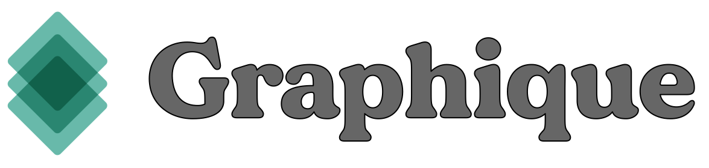
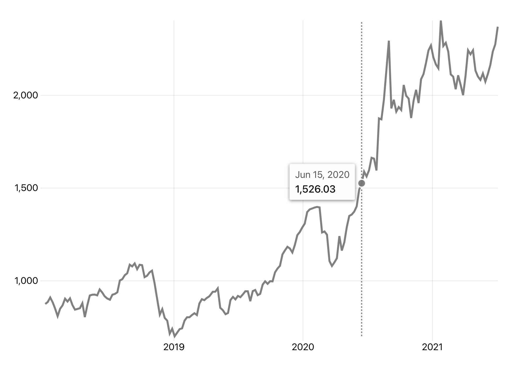

<div align="center">
  <a href="https://graphique.dev">
    
  </a>
  <p>
  An interactive visualization system for React based on the Grammar of Graphics
  </p>
</div>

<hr />

## Graphique

Graphique allows you to concisely create flexible and reusable interactive visualizations by:

- mapping variables in data to visual components or _aesthetics_ specified by [scales](#scales) (_how_ to draw)
- composing or layering relatively simple graphical objects or [geometries](#geoms) (_what_ to draw)
- using reasonable defaults that can be configured for flexibility

## Examples/Docs
Examples and docs: https://graphique.dev

## Usage

#### Creating a simple, interactive line chart

Install only the geometries you need.

```shell
npm install @graphique/graphique @graphique/geom-line @graphique/datasets
```

or

```shell
yarn add @graphique/graphique @graphique/geom-line @graphique/datasets
```

```jsx
import React from 'react'
import ReactDOM from 'react-dom'
import { GG } from '@graphique/graphique'
import { GeomLine } from '@graphique/geom-line'
import { stocks } from '@graphique/datasets'

// default basic line chart
const LineChart = () => {
  return (
    <GG
      data={stocks.filter((d) => d.symbol === 'AAPL')}
      aes={{
        x: (d) => new Date(d.date),
        y: (d) => d.marketCap,
      }}
    >
      <GeomLine />
    </GG>
  )
}

ReactDOM.render(<LineChart />, document.getElementById('root'))
```

<div align="center">
  
</div>

## Responsive

To keep your Graphique visualization the width of its parent container, you only need to specify `isContainerWidth` and you'll get an appropriately-scaled and responsive version.

```jsx
<GG
  data={stocks.filter((d) => d.symbol === 'AAPL')}
  aes={{
    x: (d) => new Date(d.date),
    y: (d) => d.marketCap,
  }}
  isContainerWidth
>
  <GeomLine />
</GG>
```

## Design philosophy

Relative to existing data visualization tools and libraries for React applications, Graphique exists "above" low-level APIs and "below" high-level/out-of-the-box/"named chart" charting libraries.

As much as possible, the routine parts of visualizing data should be taken care of for you. This means (by default) you shouldn't need to manually create your own scales, axes, coordinate systems, tooltips, interactive legends, animated transitions, or responsive logic. But when it comes time, you can customize/override nearly everything to suit your specific needs.

With sensible defaults, Graphique aims to be just opinionated enough to make the process of creating highly customizable visualizations as streamlined as possible. Graphique is directly inspired by [ggplot2](https://ggplot2.tidyverse.org/), and under the hood it's built on [d3](https://d3js.org).

## A layered approach

```jsx
// empty / no geoms
// defaults provide:
// x/y scales, coordinate system,
// grid, axes, ticks, dimensions, theme
<GG
  data={stocks}
  aes={{
    x: (d) => new Date(d.date),
    y: (d) => d.marketCap,
  }}
/>
```

<h3 id='scales'>Aesthetics/Scales</h3>

**_How to draw_**. The specifications for how data characteristics relate to visual characteristics (functional mappings/transformations applied to `data`).

| **Aesthetic** (**Scale**)            | **Specifies**                                           | **Notes**                         |
| ------------------------------------ | ------------------------------------------------------- | --------------------------------- |
| `x` (`ScaleX`)                       | x positions of geometry objects, axis creation          |
| `y` (`ScaleY`)                       | y positions of geometry objects, axis creation          |
| `fill` (`ScaleFill`)                 | fill color of geometry objects, groups if categorical   |
| `stroke` (`ScaleStroke`)             | stroke color of geometry objects, groups if categorical |
| `strokeDasharray` (`ScaleDashArray`) | dash pattern of geometry objects, groups                | categorical only                  |
| `size` (`ScaleSize`)                 | size of geometry objects                                | continuous only, `GeomPoint` only |
| `group` (`n/a`)                      | explicit groups for geometry objects                    |
| `label` (`n/a`)                      | main label for geometry object tooltips                 |
| `key` (`n/a`)                        | uniqueness/identity of geometry objects                 |

You can add one or more `Scale`s directly to customize things like its type ([d3 scale](https://github.com/d3/d3-scale#api-reference)), domain, values, formatting, etc.

```jsx
// a log-transformed y scale with
// custom domain and formatted as USD
<GG
  data={data}
  aes={{
    x: (d) => d.xVal,
    y: (d) => d.yVal,
  }}
>
  <ScaleY
    type={d3.scaleLog}
    domain={[0, 100000]}
    format={({ value }) => `$${value.toLocaleString()}`}
  />
</GG>
```

<h3 id='geoms'>Geometries</h3>

**_What to draw_**. The shapes that give a visualization something to visualize.

- `GeomLine`: line charts and other kinds of lines
- `GeomPoint`: scatterplots, dotplots, and bubble charts
- `GeomTile`: rectangular charts like heatmaps
- `GeomBar`: bar charts (horizontal bars)
- `GeomCol`: column charts (vertical bars)
- `GeomHist`: histograms
- `GeomArea`: area + stacked area charts and ribbon-like things
- `GeomVLine`: vertical lines / markers
- `GeomHLine`: horizontal lines / markers
- TODO: `GeomLabel`, `GeomSmooth`, `GeomSegment`, `GeomDensity`, and more on the way!

<h3 id='labels'><code>Labels</code></h2>

Give the main parts flexible, human-readable labels.

- `header`
- `x`
- `y`

<h3 id='legend'><code>Legend</code></h2>

Each Geom includes a `<Legend>` that can be added to your Graphique visualization. Continuous `aes`<->`data` return values get continuous legends. Categorical `aes`<->`data` return values get categorical legends.

<h3 id='tooltip'><code>Tooltip</code></h3>

Tooltips are provided for each Geom for free. They're configurable and you can roll your own based on the relevant contextual information (x value, y value, etc) with `<Tooltip>`. If you'd prefer the Geom to not use a tooltip, you can turn it off by passing `showTooltip={false}` to the Geom.

<h3 id='theme'><code>Theme</code></h3>

Customize the look and feel of your Graphique visualizations.

```jsx
// a custom theme
<Theme
  grid={{ stroke: 'none' }}
  axis={{ tickStroke: '#ddd' }}
  axisX={{ showAxisLine: true }}
  font={{ family: 'Inter, system-ui, sans-serif' }}
/>
```

## Roadmap

- more `Geom`s
- linked graphics inside `<GGgroup>`

## Dev

### Testing

```sh
npm test
```

#### Run only some tests

For example, you can also choose to run only some tests with things like:

```sh
# run only GeomLine tests
npm test GeomLine

# run only Tooltip tests (multiple Geoms)
npm test Tooltip
```

### Demo local pacakages

For a place to try out new package changes locally, there's an included React app located in `demo` that you can start with

```sh
npm run demo
```

If you also watch for changes to the package you're developing with

```sh
npm run watch -w @graphique/<package_name>
```

the demo app should live reload when you save your package changes.

### Publishing and releasing

Use `npm run release` to publish and release new version(s) of package(s).
