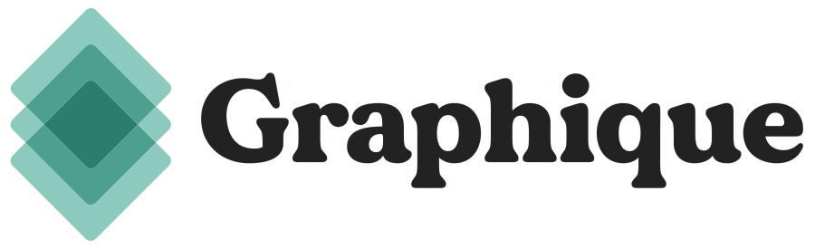
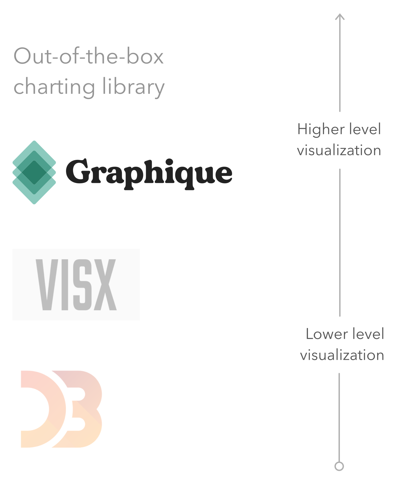

<div align="center">
  <a href="https://mattadams.io/graphique">
    
  </a>
  <p>
  An interactive visualization system for React based on the Grammar of Graphics.
  </p>
</div>

<hr />

## Graphique

Graphique allows you to concisely create flexible and reusable interactive visualizations by:

- mapping variables in data to visual components or aesthetics (`aes`)
- composing or layering relatively simple graphical objects ([geometries](#geoms), [scales](#scales), etc.)
- using reasonable defaults that can be configured for flexibility

## Usage

#### Creating a simple, interactive line chart

Install only the geometries you need.

```
$ npm install @graphique/gg @graphique/geom-line @visx/mock-data
```

or

```
$ yarn add @graphique/gg @graphique/geom-line @visx/mock-data
```

```jsx
import React from "react"
import ReactDOM from "react-dom"
import { GG } from "@graphique/gg"
import { GeomLine } from "@graphique/geom-line"
import { appleStock } from "@visx/mock-data"

// default basic line chart
const LineChart = () => {
  return (
    <GG
      data={appleStock.slice(400, 700)}
      aes={{
        x: d => new Date(d.date),
        y: d => d.close,
      }}
    >
      <GeomLine />
    </GG>
  )
}

ReactDOM.render(
  <LineChart />,
  document.getElementById("root")
)
```

<div align="center">
  
</div>

## Responsive

To keep your Graphique visualization the width of its parent container, you only need to specify `useParentWidth` and you'll get an appropriately-scaled and responsive version.

```jsx
 <GG
  data={appleStock.slice(400, 700)}
  aes={{
    x: d => new Date(d.date),
    y: d => d.close,
  }}
  useParentWidth
>
  <GeomLine />
</GG>
```

## Examples

Check out out the Storybook demos here: https://graphique.mattadams.io

## Design philosophy

Relative to existing tools and libraries for creating interactive data visualizations for React applications, Graphique exists "above" low-level APIs and "below" high-level/out-of-the-box/"named chart" charting libraries.

<div align="center">
  
</div>

With sensible defaults, Graphique aims to be just opinionated enough to make the process of creating highly customizable visualizations as streamlined as possible. Graphique is inspired by [ggplot2](https://ggplot2.tidyverse.org/), and under the hood it's built on [visx](https://airbnb.io/visx/) (both are awesome).

## A layered approach

```jsx
// empty / no geoms
// defaults provide:
// coordinate system, grid, axes,
// ticks w/ labels, size, theme
<GG
  data={appleStock.slice(400, 700)}
  aes={{
    x: d => new Date(d.date),
    y: d => d.close,
  }}
/>
```

<h3 id='geoms'><code>Geom</code>*</h3>

- `GeomLine`: line charts and other kinds of lines
- `GeomPoint`: scatterplots, dotplots, and bubble charts
- `GeomSmooth`: local smoothing and regression with standard error bands
- `GeomBar`: bar charts (and columns depending on x/y orientation) - (*in progress*)
- `GeomHist`: histograms - (*in progress*)
- TODO: `GeomLabel`, `GeomHLine`, `GeomVLine`, `GeomTile`, `GeomArea`, `GeomDensity`, and more on the way!

<h3 id='scales'><code>Scale</code>*</h3>

For specifying how data characteristics relate to visual characteristics.

- `ScaleX` / `ScaleY`
- `ScaleFill` 
- `ScaleSize` 
- `ScaleStroke` 
- `ScaleDashArray`

<h2 id='labels'><code>Labels</code></h2>

Give the main parts flexible, human-readable labels.

- `title`
- `x`
- `y`

<h3 id='tooltip'><code>Tooltip</code></h3>

Tooltips are provided for each Geom for free. If multiple Geoms are used, the last one will be the Geom that has a `Tooltip` associated with it. They're configurable and you can roll your own based on the relevant contextual information (x value, y value, etc). If you'd prefer the Geom to not use a tooltip, you can turn it off by passing `hideTooltip` to the Geom.

<h3 id='theme'><code>Theme</code></h3>

Customize the look and feel of your Graphique visualizations.

```jsx
// a dark theme
<Theme
  axis={{
    tickLabelColor: "#999",
    labelColor: "#aaa",
  }}
  grid={{ stroke: "#66666623" }}
  markerStroke="#000"
  titleColor="#eee"
  font={{ family: "Helvetica Neue, sans-serif" }}
/>
```

## Roadmap

- auto-generated, interactive `Legend` that can filter data
- more continuous scales (fills, strokes, etc.)
- linked graphics inside `<GGgroup>`
- more `Geom`s
- more and better animation/transitions
- incorporate visx's [`<XYChart />`](https://airbnb.io/visx/xychart)
- remove [Recoil](https://recoiljs.org/) dependency